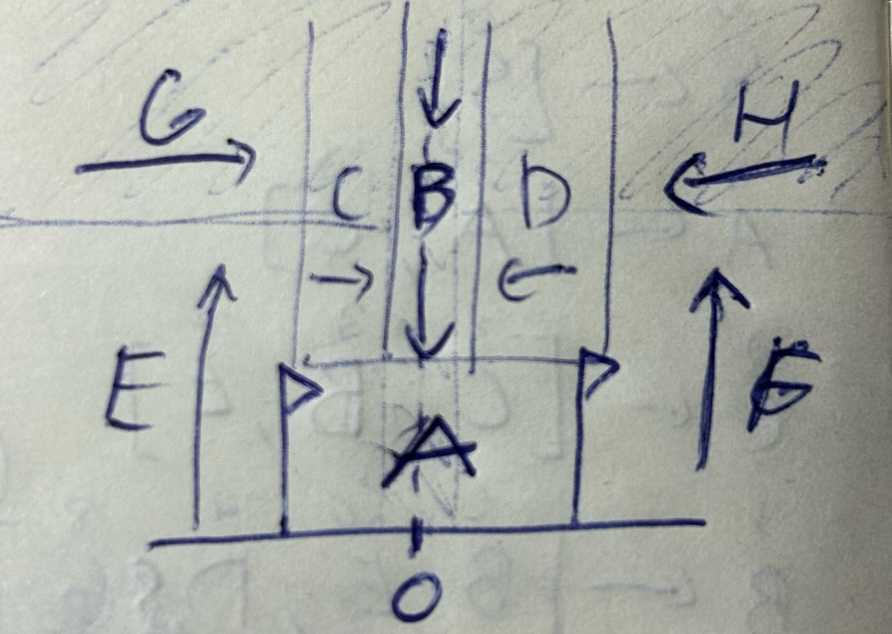

# Moon Lander

## Authors

- Francisco Amado Lapa Marques Silva - 2022213583 - francisco.lapamsilva@gmail.com - [PL2]
- Guilherme Fernandes Rodriges - 2022232102 - gfr04@gmail.com - [PL2]
- Miguel Teixeira de Pina Monteiro Pereira - 2022232552 - miguelmpereira0409@gmail.com - [PL2]

## Index

1. [Perceptions](#perception)
2. [Actions](#actions)
3. [Modulate Behaviour](#modulate)
4. [Conclusion (other information)](#conclusion)

## Perceptions

To manage this, we will utilize the built-in perceptions of the lander, and a zoning system to determine safe and unsafe zones, so that the lander can react according to it's placement, as describled by the image:

- **Za** - Lander is in the LANDING ZONE
- **Zb** - Lander is in the SAFEST DESCENT ZONE
- **Zc** - Lander is in the LEFT SAFE DESCENT ZONE
- **Zd** - Lander is in the RIGHT SAFE DESCENT ZONE
- **Ze** - Lander is in the LEFT UNSAFE ZONE
- **Zf** - Lander is in the RIGHT UNSAFE ZONE
- **Zg** - Lander is in the LEFT UPPER SAFE ZONE
- **Zh** - Lander is in the RIGHT UPPER SAFE ZONE
- **Vx** - Value of the Horizontal Velocity, with positive being to the right.
- **Vy** - Value of the Vertical Velocity, with positive being up.
- **A** - Angular Direction of the lander, positive rotation being counter-clock-wise.
- **Va** - Angular Velocity of the lander, positive rotation being counter-clock-wise.
- **L** - Left-leg is on the ground.
- **R** - Right-leg is on the ground.

## Actions

To control the Moon Lander, we use these actions:

- Mp0 - Main Motor (principal) OFF =0.0
- MP1 - Main Motor partially ON =0.1
- Mp6 - Main Motor ON =1.0

- Ms0 - Secondary Motor OFF =0.0
- Msl1 - Secondary Motor Left set to slightly rotate right =0.55
- Msl2 - Secondary Motor Left set to move right =0.8
- Msr1 - Secondary Motor Right set to slightly rotate left =-0.55
- Msr2 - Secondary Motor Right set to move left =-0.8

## Production System
To maximise successful landings, our priority is to maintain controlability of the lander, and only when that is guarenteed, do we move for the land. The basic set of instructions the lander must follow, regardless of position/zone is:
1. Va≳{max angular velocity allowed in zone} → MP1, Msl1    [to prevent lander spinning out]
2. Va≲-{max angular velocity allowed in zone} → MP1, Mrl1   [to prevent lander spinning out] 
3. Vx≳{max x velocity allowed in zone} → MP1, Msl2      [to prevent lander moving to the right]
4. Vx≲-{max x velocity allowed in zone} → MP1, Mrl2     [to prevent lander moving to the left]
3. Vy≳{max y up velocity allowed in zone} → MP0                 [to prevent lander from flying away]
4. Vy≲-{max y descent velocity allowed in zone} → MP2           [to prevent lander from gaining too much speed]

With these basic rules, we can create the actual PS, changing the {...} values according to what the lander should do in it's current zone.
We also need to define some constants, for determing the values that we want to set for the perceptions:
 - MAS: Maximum Angular Speed
 - MXS: Maximum X Speed
 - MYS: Maximum Y Speed

Like this:

1.  Za, Va≳0 → MP1, Msl1    [to prevent lander spinning out]
2.  Za, Va≲0 → MP1, Mrl1    [to prevent lander spinning out]
3.  Za, Vx≳0 → MP1, Msl2        [to prevent lander moving to the right]
4.  Za, Vx≲0 → MP1, Mrl2        [to prevent lander moving to the left]
5.  Za, Vy≳0 → MP0                  [to prevent lander from flying away]
6.  Za, Vy≲0 → MP2                  [to prevent lander from going down]

7.  Zb, Va≳0 → MP1, Msl1    [to prevent lander spinning out]
8.  Zb, Va≲0 → MP1, Mrl1    [to prevent lander spinning out]
9.  Zb, Vx≳0 → MP1, Msl2        [to prevent lander moving to the right]
10. Zb, Vx≲0 → MP1, Mrl2        [to prevent lander moving to the left]
11. Zb, Vy≳0 → MP0                  [to prevent lander from flying away]
12. Zb, Vy≲-MYS → MP2               [to prevent lander from gaining too much speed]

13. Zc, Va≳0 → MP1, Msl1    [to prevent lander spinning out]
14. Zc, Va≲-MAS → MP1, Mrl1 [to prevent lander spinning out, while still allowing rotation towards the right]
15. Zc, Vx≳MXS → MP1, Msl2      [to prevent lander moving too fast to the right]
16. Zc, Vx≲0 → MP1, Mrl2        [to prevent lander moving to the left]
17. Zc, Vy≳0 → MP0                  [to prevent lander from flying away]
18. Zc, Vy≲-MYX → MP2               [to prevent lander from gaining too much speed, while still allowing descent]

19. Zd, Va≳MAS → MP1, Msl1  [to prevent lander spinning out, while still allowing rotation towards the left]
20. Zd, Va≲0 → MP1, Mrl1    [to prevent lander spinning out]
21. Zd, Vx≳0 → MP1, Msl2        [to prevent lander moving to the right]
22. Zd, Vx≲-MXS → MP1, Mrl2     [to prevent lander moving too fast to the left]
23. Zd, Vy≳0 → MP0                  [to prevent lander from flying away]
24. Zd, Vy≲MYX → MP2               [to prevent lander from gaining too much speed, while still allowing descent]

25. Ze, Va≳0 → MP1, Msl1    [to prevent lander spinning out]
26. Ze, Va≲0 → MP1, Mrl1    [to prevent lander spinning out]
27. Ze, Vx≳MXS → MP1, Msl2      [to prevent lander moving too fast to the right]
28. Ze, Vx≲0 → MP1, Mrl2        [to prevent lander moving to the left]
29. Ze, Vy≳MYS → MP0                [to prevent lander from flying up too fast]
30. Ze, Vy≲0 → MP2                  [to prevent lander from going down]

31. Zf, Va≳0 → MP1, Msl1    [to prevent lander spinning out]
32. Zf, Va≲0 → MP1, Mrl1    [to prevent lander spinning out]
33. Zf, Vx≳0 → MP1, Msl2        [to prevent lander moving to the right]
34. Zf, Vx≲MXS → MP1, Mrl2      [to prevent lander moving too fast to the left]
35. Zf, Vy≳MYS → MP0                [to prevent lander from flying up too fast]
36. Zf, Vy≲0 → MP2                  [to prevent lander from going down]

37. Zg, Va≳0 → MP1, Msl1    [to prevent lander spinning out]
38. Zg, Va≲-MAS → MP1, Mrl1 [to prevent lander spinning out, while still allowing rotation towards the right]
39. Zg, Vx≳MXS → MP1, Msl2      [to prevent lander moving too fast to the right]
40. Zg, Vx≲0 → MP1, Mrl2        [to prevent lander moving to the left]
41. Zg, Vy≳0 → MP0                  [to prevent lander from flying away]
42. Zg, Vy≲0 → MP2                  [to prevent lander from going down]

43. Zh, Va≳MAS → MP1, Msl1  [to prevent lander spinning out, while still allowing rotation towards the left]
44. Zh, Va≲0 → MP1, Mrl1    [to prevent lander spinning out]
45. Zh, Vx≳0 → MP1, Msl2        [to prevent lander moving to the right]
46. Zh, Vx≲-MXS → MP1, Mrl2     [to prevent lander moving too fast to the left]
47. Zh, Vy≳0 → MP0                  [to prevent lander from flying away]
48. Zh, Vy≲0 → MP2                  [to prevent lander from going down]

## Conclusion
We believe that this system could be further bettered, perhaps by tweaking the thresshold values, the actions' values, and sizes of zones, and also by further combining the existing perceptions to better respond to a combination of states that this current system cannot handle simultaneously.